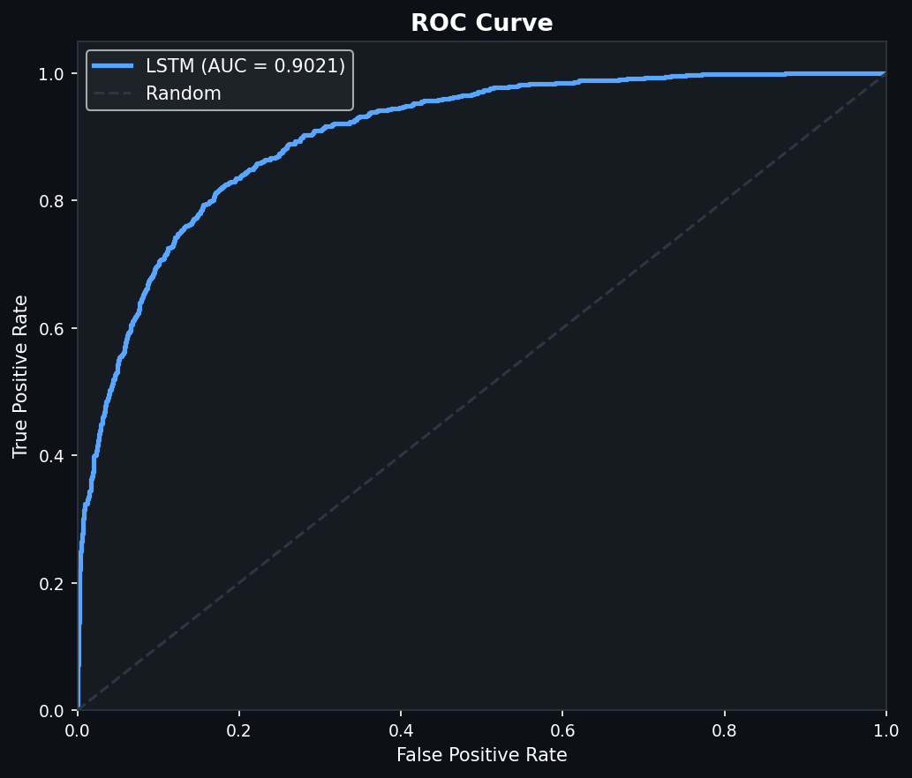
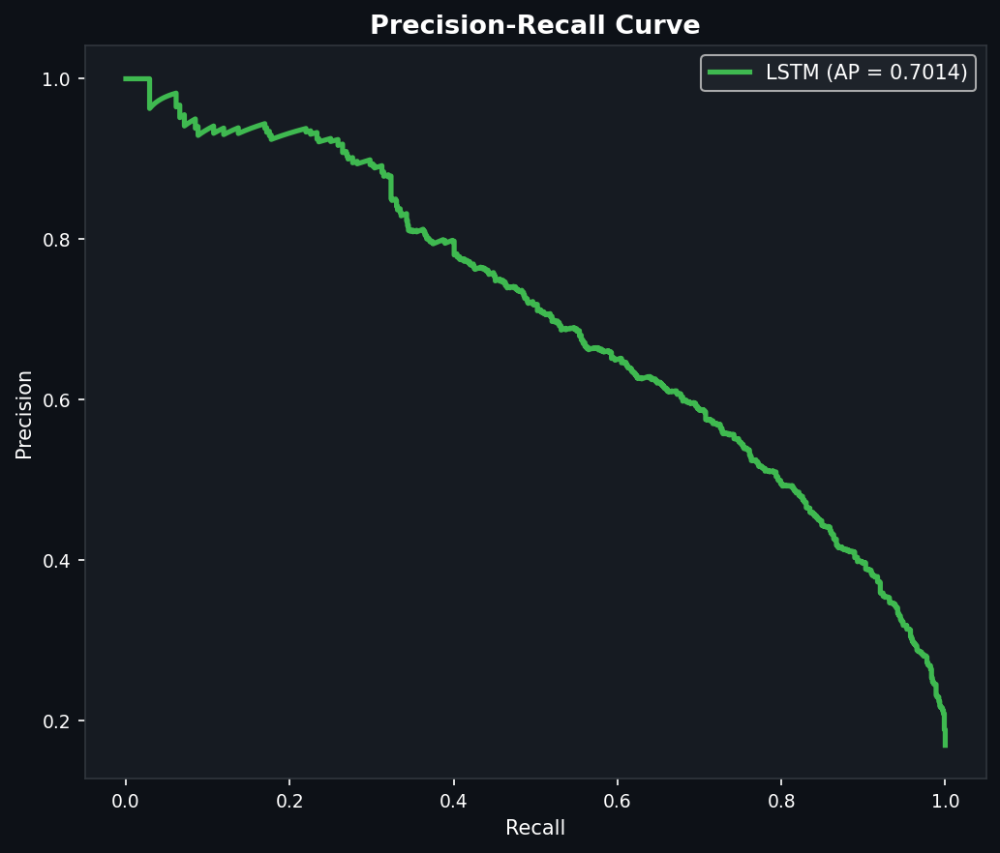
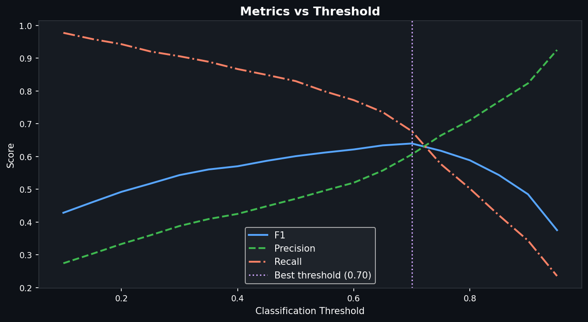

# Heart Disease Temporal Analysis

Longitudinal deep-learning pipeline for predicting cardiac condition progression
from ICU admissions in MIMIC-IV. The project builds patient visit sequences and
trains sequence models for binary classification:

- `1`: worsening cardiac progression
- `0`: stable or improving progression

The main real-data path uses the downloaded MIMIC-IV 2.1 ZIP at:

```text
data/mimic_iv_raw/mimic-iv-2-1.zip
```

## Current Status

- MIMIC-IV 2.1 ZIP is present locally.
- The existing `data/preprocessed` arrays are small (`350/75/75` split), so they
  should be treated as a smoke-test dataset, not final full-dataset training.
- Generated outputs such as model checkpoints, plots, result JSON/TXT files, and
  the local virtual environment are disposable and ignored.
- The active feature schema has `59` features per timestep.

## Project Structure

```text
Temporal Analysis/
|-- README.md
|-- requirements.txt
|-- evaluate_trained_models.py
|-- docs/
|   |-- project_architecture.md
|   |-- dataset.md
|   |-- model_results.md
|   `-- models/
|       |-- bilstm_attention.md
|       |-- bigru.md
|       `-- transformer_encoder.md
|-- data/
|   |-- mimic_iv_raw/          # MIMIC-IV ZIP, not committed
|   `-- preprocessed/          # .npy arrays and scaler, not committed
|-- notebooks/
|   `-- mimiciv_colab_gpu_training.ipynb
|-- src/
|   |-- run_full_colab_training.py
|   |-- run_full_local_pipeline.py
|   |-- preprocessing/
|   |   |-- download_mimiciv_dataset.py
|   |   |-- inspect_mimiciv_items.py
|   |   `-- build_cardiac_progression_dataset.py
|   |-- model_training/
|   |   |-- train_bilstm_attention.py     # BiLSTM + attention
|   |   |-- train_bigru.py                # BiGRU baseline
|   |   |-- train_transformer_encoder.py  # Transformer encoder
|   |   `-- predict_bilstm_patient.py
|   `-- reporting/
|       |-- plot_dataset_overview.py
|       `-- plot_model_results.py
```

## Local Setup

```bash
python -m venv .venv
.venv\Scripts\activate
pip install -r requirements.txt
```

## Build Real Dataset

Use this when you want to rebuild arrays from the full downloaded MIMIC-IV ZIP:

```bash
python src/preprocessing/build_cardiac_progression_dataset.py --zip data/mimic_iv_raw/mimic-iv-2-1.zip --chunk 100000 --seq_len 6
```

Lower `--chunk` to `25000` or `50000` if RAM is limited. The script streams the
large CSVs from the ZIP and saves:

```text
data/preprocessed/X_train.npy
data/preprocessed/X_val.npy
data/preprocessed/X_test.npy
data/preprocessed/y_train.npy
data/preprocessed/y_val.npy
data/preprocessed/y_test.npy
data/preprocessed/preprocessor.pkl
data/preprocessed/feature_names.pkl
```

## Train Models Locally

```bash
python src/model_training/train_bilstm_attention.py --epochs 80 --lr 0.0003 --batch_size 64 --patience 12
python src/model_training/train_bigru.py --epochs 80 --lr 0.0003 --batch_size 64 --patience 12
python src/model_training/train_transformer_encoder.py --epochs 80 --lr 0.0003 --batch_size 64 --patience 12
python evaluate_trained_models.py
```

`train_bilstm_attention.py` is the BiLSTM model: it uses a 2-layer bidirectional
LSTM with an attention pooling head. `train_transformer_encoder.py` trains a
Transformer Encoder Classifier: it is an encoder-only Transformer with a CLS
classification token, sinusoidal positional encoding, 8-head self-attention,
and 3 encoder layers.

## Train on Google Colab GPU

Use the notebook:

```text
notebooks/mimiciv_colab_gpu_training.ipynb
```

Recommended Colab flow:

1. Upload this project folder to Google Drive.
2. Put `mimic-iv-2-1.zip` in `data/mimic_iv_raw/`.
3. Open the notebook in Colab.
4. Runtime -> Change runtime type -> GPU.
5. Run the notebook top to bottom.

The notebook installs dependencies, mounts Drive, verifies GPU availability,
rebuilds the complete dataset from `mimic-iv-2-1.zip`, trains BiLSTM attention,
BiGRU, and the Transformer Encoder Classifier, then compares metrics with
`evaluate_trained_models.py`.

The notebook calls this strict full-run command:

```bash
python src/run_full_colab_training.py --zip data/mimic_iv_raw/mimic-iv-2-1.zip --chunk 100000 --seq_len 6 --epochs 80 --lr 0.0003 --batch_size 128 --hidden_size 128 --patience 12
```

By default this command removes old generated `data/preprocessed`, `models`,
`visualizations`, and `results.json` outputs first, so final training does not
accidentally reuse the small smoke-test arrays.

## Model Inputs

Each sample has shape:

```text
(sequence_length, 59_features)
```

Default sequence length is `6` ICU stays. Patients with fewer stays are padded
from their earliest available stay.

Feature groups include:

- Vital signs: heart rate, blood pressure, respiratory rate, temperature, SpO2
- Cardiac markers: troponin, BNP, NT-proBNP
- Metabolic and renal labs: creatinine, BUN, glucose
- Electrolytes: potassium, sodium, chloride, bicarbonate
- CBC: hematocrit, hemoglobin, WBC, platelets
- Clinical context: age, length of stay, prior cardiac conditions, ICU/admission flags
- Temporal context: days since prior admission, time delta, visit index

## Model Outputs

Each model outputs a sigmoid probability of worsening progression. The default
classification threshold is `0.5`; compare AUC-ROC, F1, recall, and precision
before choosing the final model for reporting.

## Latest Recorded Result

The latest full Colab run trained all three models on the full MIMIC-IV
cardiac progression dataset. The held-out test set had 5,289 samples:
896 worsening cases and 4,393 stable/improving cases.

```text
docs/model_results.md
results.json
```

Final model comparison on the MIMIC-IV test set:

| Model | Accuracy | Precision | Recall | F1 Score | AUC-ROC |
|---|---:|---:|---:|---:|---:|
| BiLSTM Attention | 0.8134 | 0.4712 | 0.8304 | 0.6012 | 0.9021 |
| BiGRU | 0.8132 | 0.4712 | 0.8404 | 0.6038 | 0.9076 |
| Transformer Encoder Classifier | 0.8198 | 0.4814 | 0.8237 | 0.6077 | 0.9096 |

Best AUC-ROC and F1 score came from the Transformer Encoder Classifier. Best
recall came from BiGRU, which caught the largest fraction of worsening cases.

Precision is lower than recall because the dataset is imbalanced: only about
16.9% of samples are worsening cases. With weighted loss, the models are
encouraged to detect the minority worsening class, so they identify many true
worsening cases but also produce more false positives. This improves recall and
AUC-ROC, but it reduces precision at the default `0.5` threshold.

### LSTM Diagnostic Curves

The following plots are from the trained LSTM/BiLSTM attention model. They show
that the model learns useful separation between worsening and stable/improving
cases.



The ROC curve has AUC `0.9021`, which is strong discrimination for the held-out
MIMIC-IV test set.



The precision-recall curve has average precision `0.7014`. This is much higher
than the positive-class base rate of about `0.169`, so the model is performing
well on the minority worsening class.



The threshold sweep shows why threshold tuning matters. The default `0.5`
threshold favors recall, while a threshold around `0.70` gives a better
precision-recall balance and the best F1 score for this model.

## Next Improvements

Planned work to improve results:

- Tune the classification threshold using validation precision-recall curves
  instead of always using `0.5`.
- Try focal loss or balanced sampling to reduce false positives while keeping
  strong recall on worsening cases.
- Calibrate predicted probabilities with Platt scaling or isotonic regression.
- Add richer temporal features such as lab/vital slopes, recent deltas, and
  missingness indicators.
- Run hyperparameter search for hidden size, dropout, learning rate, number of
  recurrent layers, Transformer encoder layers, and attention heads.
- Compare model performance across clinically meaningful subgroups and tune for
  the preferred clinical tradeoff between recall and precision.

## Expected Workflow for Final Results

```bash
python src/preprocessing/build_cardiac_progression_dataset.py --zip data/mimic_iv_raw/mimic-iv-2-1.zip --chunk 100000 --seq_len 6
python src/model_training/train_bilstm_attention.py --epochs 80 --lr 0.0003 --batch_size 64 --patience 12
python src/model_training/train_bigru.py --epochs 80 --lr 0.0003 --batch_size 64 --patience 12
python src/model_training/train_transformer_encoder.py --epochs 80 --lr 0.0003 --batch_size 64 --patience 12
python evaluate_trained_models.py
python src/reporting/plot_model_results.py
```

## Troubleshooting

If training prints `Train Loss: nan` from the first epoch, stop the run. That
usually means the saved `X_*.npy` arrays contain `NaN` or infinite values, and
the apparent 83 percent accuracy is just the majority stable/improving class.
The preprocessing script now sanitizes arrays before saving, and every trainer
validates the arrays before training.
